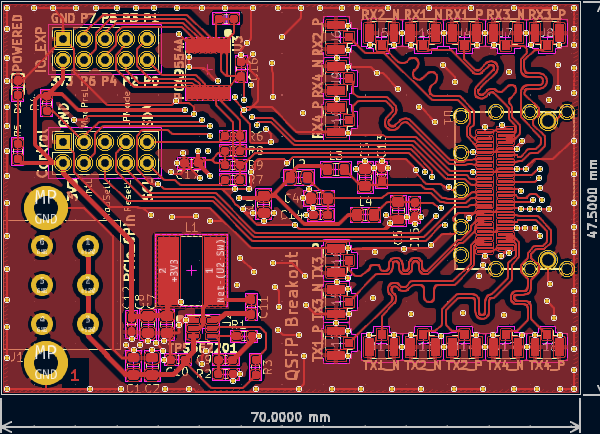
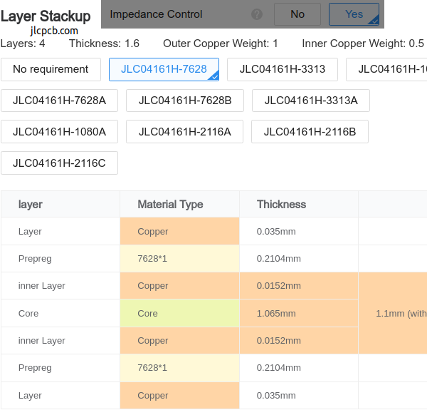

**Work-In-Progress**: [Gerbers ready](https://github.com/mwrnd/QSFP_Breakout/releases/tag/v0.1.1-alpha) but not yet ordered.

# QSFP Breakout

[QSFP](https://en.wikipedia.org/wiki/Small_Form-factor_Pluggable#QSFP) to [U.FL/UMCC Connector](https://en.wikipedia.org/wiki/Hirose_U.FL) breakout.

Additional I2C circuitry is due to this being a stepping stone project for an [OpenCAPI](https://files.openpower.foundation/s/xSQPe6ypoakKQdq/download/25Gbps-spec-20171108.pdf) to **dual** QSFP design. OpenCAPI has only a single I2C interface.

# PCB Layout

All differential signals are length-matched to within 1mm of a 25mm total length, both inter-pair and intra-pair.

# Schematic

# PCB Layer Stackup

4-Layer PCB stackup taken from [JLCPCB](https://jlcpcb.com/capabilities/pcb-capabilities).

100-ohm Differential Impedance parameters were calculated using the [DigiKey Online Calculator](https://www.digikey.com/en/resources/conversion-calculators/conversion-calculator-pcb-trace-impedance).

